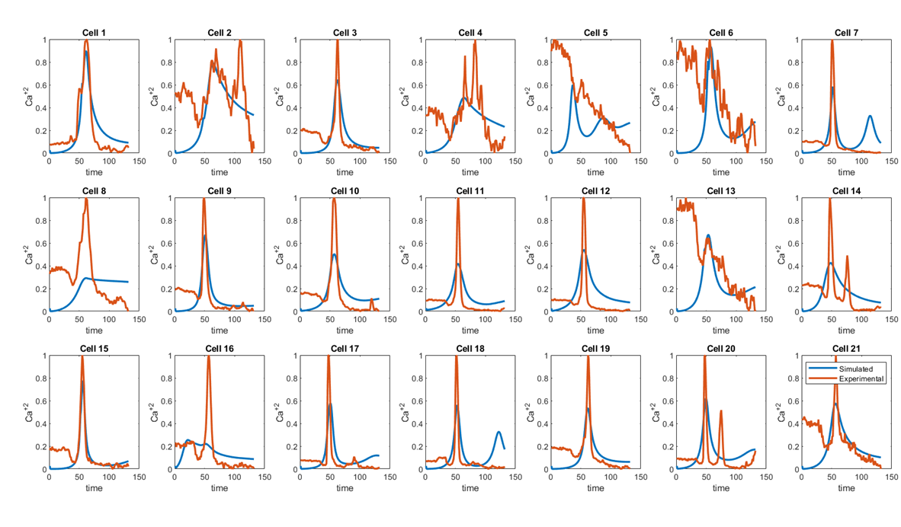

# High-Throughput ODE Model Fitting with Genetic Algorithm & Parallel Computing

This repository showcases a cutting-edge approach to fitting a complex ODE model to cellular fluorescence data using a Genetic Algorithm (GA). By simultaneously fitting multiple cells, this method tackles the challenge of a high-dimensional parameter space, made feasible through advanced parallel computing techniques.

## Overview

In modeling calcium ion concentration ( Ca^+2 ) dynamics across multiple cells, this project pushes the boundaries of computational biology. Each cell's behavior is modeled simultaneously, dramatically increasing the number of parameters to be optimized. This level of complexity, while computationally expensive, enables a more accurate and robust fitting process.

## Key Features

- **Multi-Cell ODE Fitting**: The script fits an ODE model across several cells at once, capturing intricate cell-to-cell interactions.
- **High-Dimensional Optimization**: Simultaneous fitting significantly expands the parameter space, ensuring a comprehensive search for optimal solutions.
- **Parallel Computing Acceleration**: Leveraging MATLAB's Parallel Computing Toolbox, the GA is massively accelerated, cutting computation time in half or more.
- **Advanced Visualizations**: Heatmaps and time-series plots provide deep insights into inter-cellular dynamics and model accuracy.

## Methodology

1. **Data Preparation**: Extract and normalize fluorescence data for multiple cells, generating the necessary inputs for the model.
2. **Distance Matrix & Heatmaps**: Compute pairwise Euclidean distances between cell vertices and visualize interactions through heatmaps (`Beta` and `Beta dash`).
3. **Initial ODE Simulation**: Run preliminary ODE simulations using a set of predefined parameters to establish a baseline.
4. **Genetic Algorithm Optimization**: Engage in high-dimensional GA optimization, where the complexity of simultaneous multi-cell fitting is tackled using parallel processing.
5. **Post-Optimization Analysis**: The optimized parameters are then applied to refine the ODE model, with results plotted against experimental data for validation.

